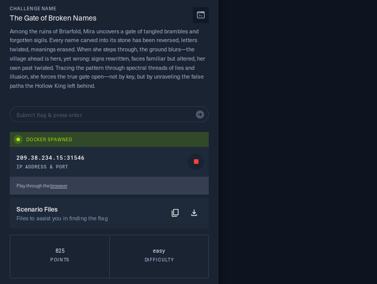

# Hack The Boo CTF - Web Challenge Write-up

## Challenge Information

**Challenge:** The Gate of Broken Names  
**Category:** Web Security  
**Difficulty:** Easy  
**Description:** 
> Among the ruins of Briarfold, Mira uncovers a gate of tangled brambles and forgotten sigils. Every name carved into its stone has been reversed, letters twisted, meanings erased. When she steps through, the ground blurs—the village ahead is hers, yet wrong: signs rewritten, faces familiar but altered, her own past twisted. Tracing the pattern through spectral threads of lies and illusion, she forces the true gate open—not by key, but by unraveling the false paths the Hollow King left behind.

---

## Initial Reconnaissance

### 1. Access the challenge

The challenge provides a spawned Docker instance and the source code. On start, you receive an IP and port to access the web app:



The initial interface is a login page with two main actions: **Login** and **Create Account**.


### 2. First information gathering

- Viewing the page source reveals nothing useful
- Use `gobuster` to enumerate directories/endpoints:

```bash
gobuster dir -u http://209.38.234.15:31546 -w directory-list-lowercase-2.3-medium.txt -x txt,log,html,js,php,py
```


Nothing stands out. It seems we need to create an account and log in to explore further.

---

## Post-Authentication Analysis

### 1. Log in and explore the Dashboard

After creating an account and logging in, I’m taken to the **Dashboard**. The app lets users manage notes (called "Chronicles").

There is a list of **Public Chronicles**.


### 2. Feature analysis

**Public notes URL:**
```
http://209.38.234.15:31546/public-notes?page=1
```

- Tried simple SQLi payloads on the `page` parameter (`'`, `1=1`, etc.) → no effect

**Create Chronicle:**
- Form has "Title" and "Content"
- Basic XSS payloads in both fields are filtered

---

## IDOR Vulnerability Discovery

### 1. Finding the pivot

After creating a note successfully, the browser redirects to:
```
http://209.38.234.15:31546/note?id=211
```


The `id` parameter in the URL suggests a potential **IDOR vulnerability**.

### 2. Validating the issue

**Try `id=1`:**
```
http://209.38.234.15:31546/note?id=1
```


→ Returns a public note (nothing special)

**Try `id=2`:**
```
http://209.38.234.15:31546/note?id=2
```


→ **Success!** We can read another user’s private note without authorization.

**Conclusion:** Any authenticated user can read any note by guessing the `id`.

---

## Exploitation

### Exploit using Burp Suite Intruder

Since my note has `id=211`, there are at least 211 notes in the database. The flag likely resides in private notes between `id=1` and `id=210`.

**Steps:**

1. Capture the request `GET /api/notes/211` in Burp Suite and send it to **Intruder**

> Note: Capture `GET /api/notes/211`, not `GET /note?id=211`. The `/api/notes/211` endpoint actually fetches the note content.


2. **Positions tab:**
   - Clear all positions
   - Select `211` in `/api/notes/211` and click "Add §"
   - The request should look like:

```http
GET /api/notes/§211§ HTTP/1.1
Host: 209.38.234.15:31546
...
```

3. **Payloads tab:**
   - Payload type: **Numbers**
   - From: **1**
   - To: **211**
   - Step: **1**

4. Click **Start Attack** and wait for the sweep to finish.


### Finding the flag

Inspect all 211 responses. Use the up/down navigation to skim quickly—you’ll find the flag in one of them. The exact `id` varies per deployment/IP, so the position is not fixed.


---

## Result

**Flag:**
```
HTB{br0k3n_n4m3s_r3v3rs3d_4nd_r3st0r3d_<hashcode>}
```

The `<hashcode>` differs per solver/environment (e.g., based on IP). My instance produced:

```
HTB{br0k3n_n4m3s_r3v3rs3d_4nd_r3st0r3d_3c9593bcde968834f7cab3777de789da}
```

This is a neat HTB mechanism to prevent flag sharing and keep things fair.

---

## Key Takeaways

### Lessons learned

1. **Always test URL `id` parameters**—especially after creating new resources
2. **IDOR occurs when** the server exposes objects by ID without authorization checks
3. **Prevention:** The server must verify the current user’s authorization for the resource

### Tools & references

- [Burp Suite Documentation](https://portswigger.net/burp/documentation)
- [OWASP: IDOR](https://owasp.org/www-community/vulnerabilities/Insecure_Direct_Object_Reference)
- [PortSwigger Web Security Academy](https://portswigger.net/web-security)

---

**Duration:** 30 minutes  
**Date:** 2025-10-25